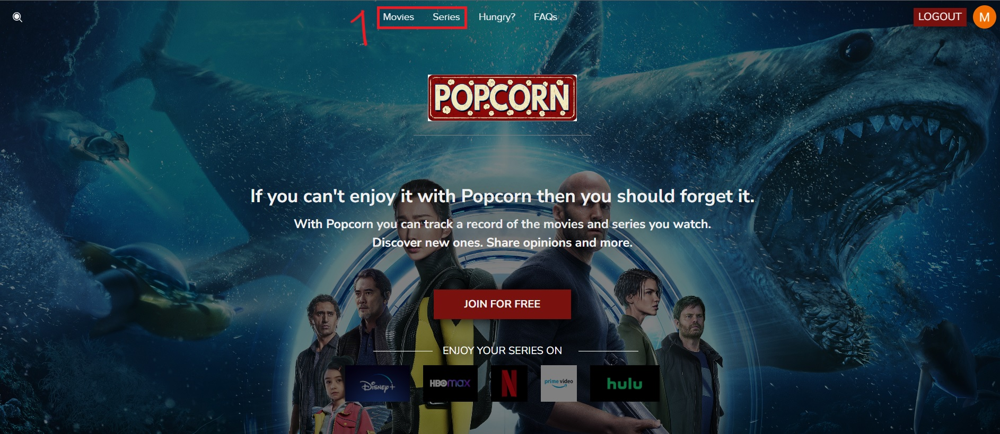

# Welcome to MovieHub!

Hi! I'm Matias. 
This page was made as a project for Assembler Institute.
I will use this readMe to explain a few things about the project.

# Basic Structure

The project is separated in two folders, server (backend) and client (frontend).
You can execute both using 'npm run dev'
Server is prepared for development enviroment at port 8080
Client will run at port 5173

# How to use the page

